這是一個基於 SwiftUI 開發的 AI 智慧旅遊規劃 App，整合了後端驗證與互動式教學功能。
以下是專案的核心摘要：
核心技術 (Tech Stack)：
前端：SwiftUI (MVVM 架構)。
後端服務：Supabase (處理使用者註冊、登入、登出與驗證)。
互動教學：使用 TipKit 建立「更換頭像」與「AI 功能」的操作指引，並客製化了「關閉後 1 分鐘自動重現」的循環提醒機制。
多媒體：使用 PhotosUI 支援從相簿選取照片作為頭像，或自訂顏色挑選背景。
推播通知：使用現成的訊息api 來模擬收到訊息時的情況

主要功能 (Key Features)：
身份驗證：完整的登入 (Sign In)、註冊 (Sign Up) 與登出 (Sign Out) 流程，並透過狀態管理 (AuthenticationViewModel) 自動切換主頁面與登入頁。
個人檔案 (Profile)：使用者可客製化大頭貼（圖片或顏色），並有視覺化的設定選單。
首頁 (Home)：包含景點輪播、分類瀏覽，以及 AI 旅遊助手 的快速入口。
AI 規劃：提供一個 AI 輸入介面（AIInputView），協助使用者快速生成旅遊行程。

簡單來說，這是一個具備完整會員系統、現代化 UI/UX 互動以及 AI 功能入口的旅遊應用程式原型。

功能需求
使用 SwiftUI 的 Binding 元件輸入資料，比方 TextField✅、Slider✅、Toggle✅、Picker✅、DatePicker✅、PhotosPicker✅、Stepper、ColorPicker✅
、MultiDatePicker。✅
利用 Foundation Models 實現本機 AI 功能，使用到 @Generable、Streaming response & Tool calling。✅
串接網路 API 抓資料。現成的訊息api✅
使用 TipKit 顯示 App 的操作說明 / 功能介紹。✅
使用 SPM 加入第三方套件。(不包含上課範例提到的套件) Supabase，markdown UI✅
使用到至少一個沒教過的功能技術，使用愈多分數愈高。可在文章裡特別說明使用哪些沒教的技術。

範例: Swift Charts、SwiftData、Widget，CLLocationManager、Firebase，多國語言、QRCode、FB SDK、ARKit、FaceID、Swift Testing、watchOS App、visionOS App。

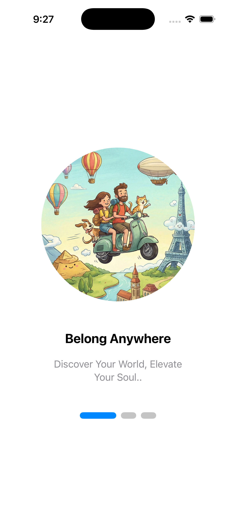

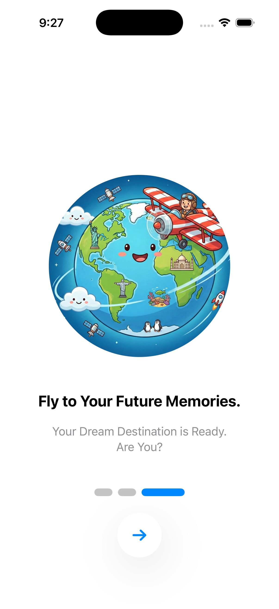
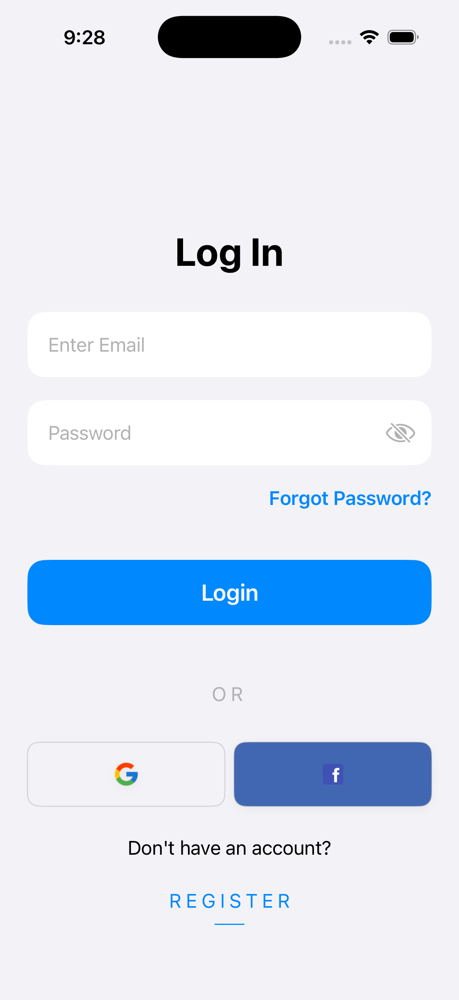
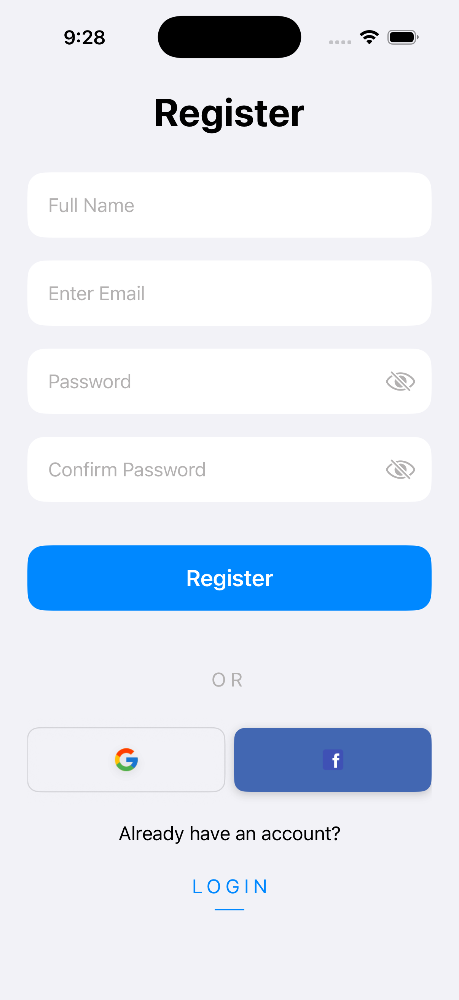
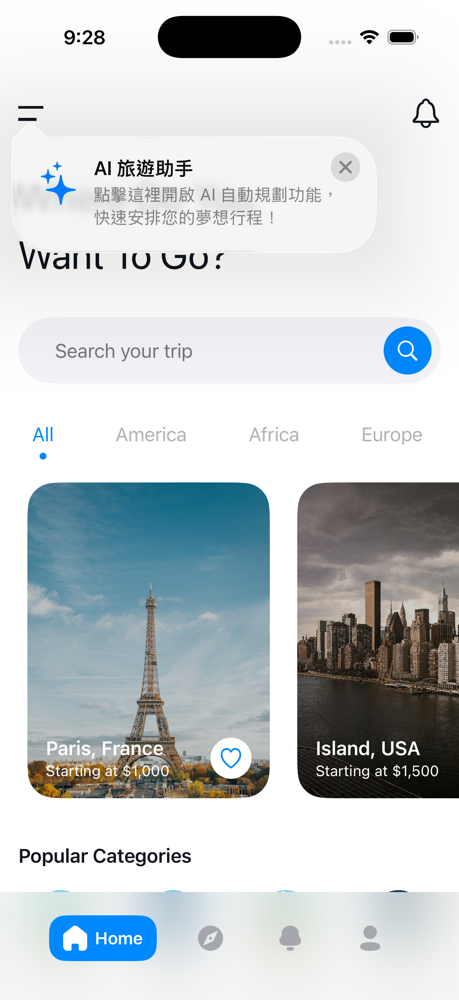

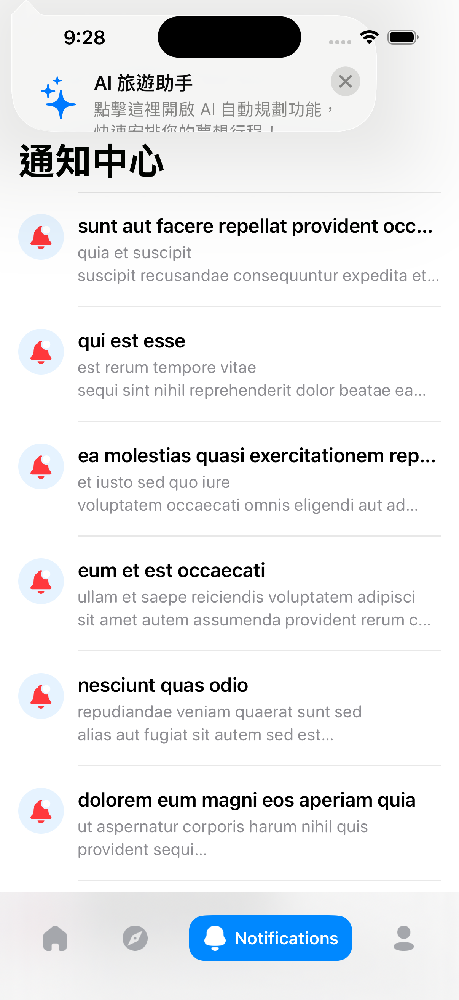
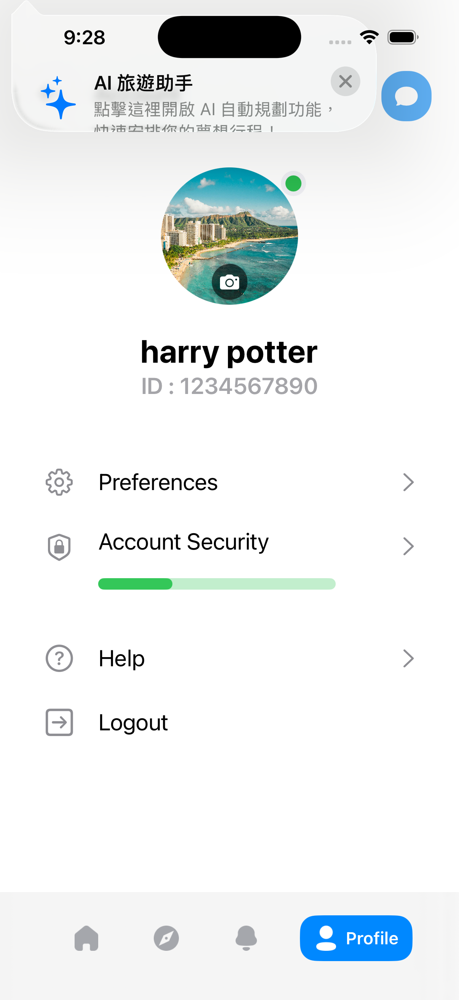
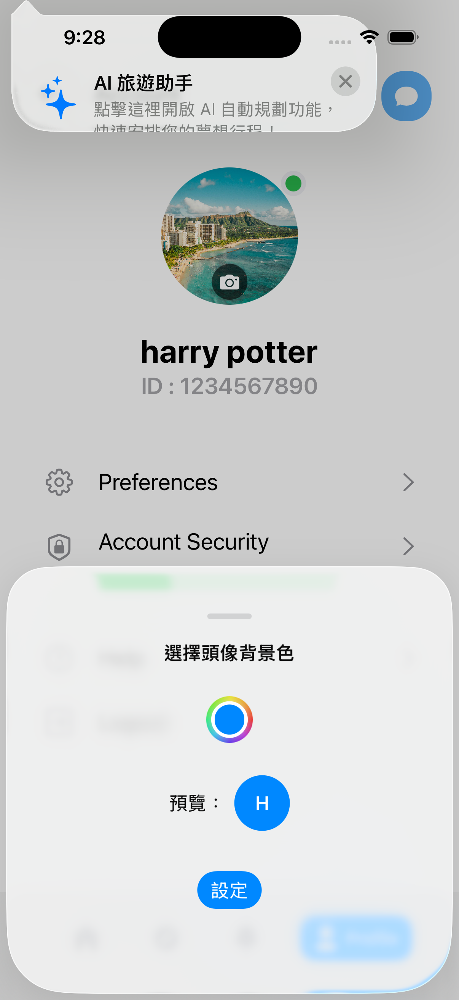
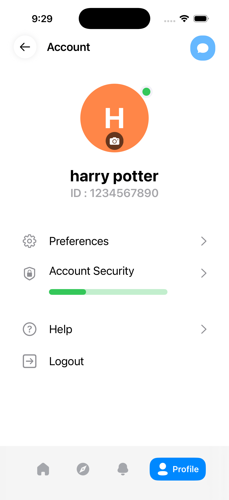
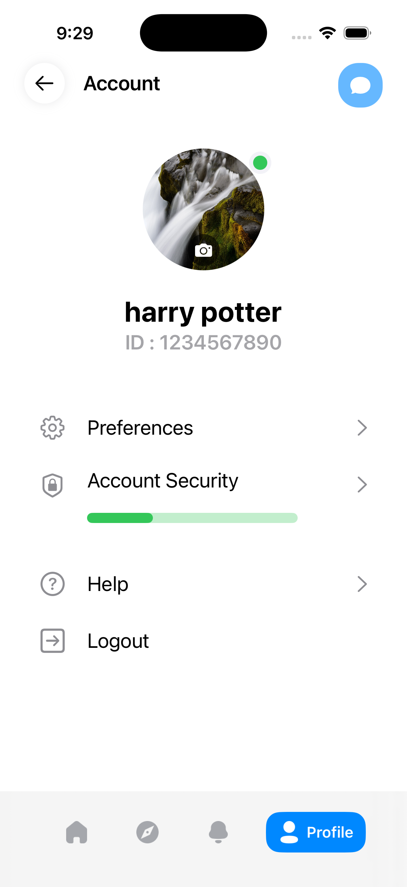

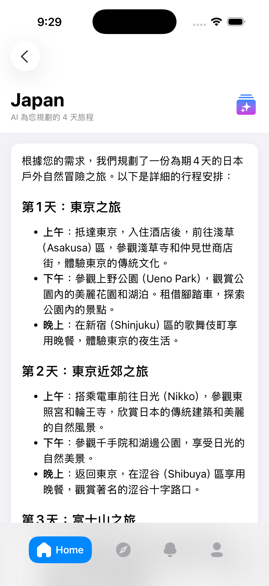
